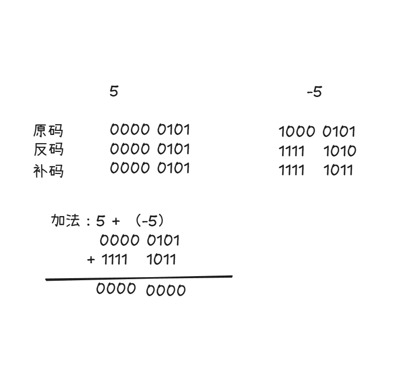
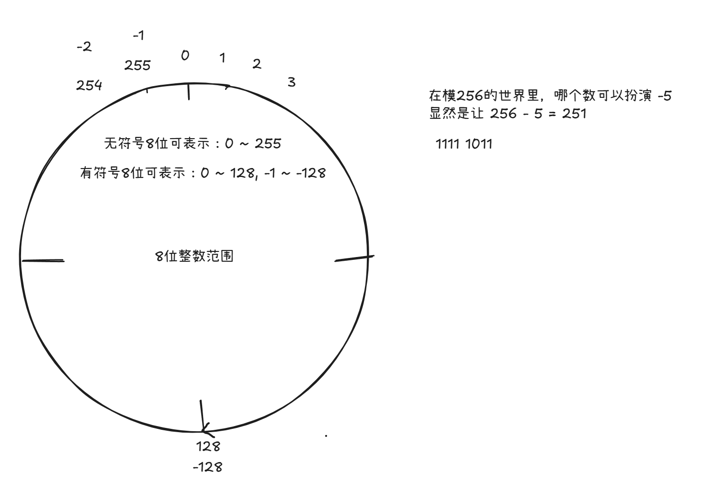
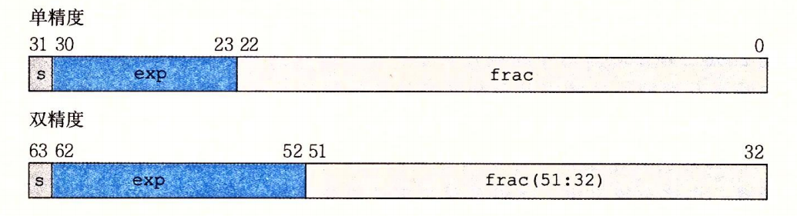

## 1. 数据类型和存储方式
C 语言的基本类型（Primitive Type) 简单的可分为两类：整型和浮点型。整型包含：char, short, int, long 以及它们的无符号形式；浮点型包含：float 和 double。C 语言面向底层编程，需要极高的内存等资源的利用率，以及需要注意溢出，截断等问题，特别是针对嵌入式硬件。因此，不同于其他语言，程序员对类型所占用存储的大小，以及类型所能表示的范围，需要了然于心。
### 1.1 整型
-  有符号整数通过二进制补码表示
- 无符号整数就是其二进制表示

按常见实现补齐：1 字节 = 8 位，有符号整数用补码，`char` 有无符合看平台实现，`long` 在 64 位 Windows 为 4 字节、在 Linux/macOS 常见为 8 字节。

| 类型                   | 所占字节 | 范围                                          | 示例            | 二进制表示（示例）                                 |
| -------------------- | ---: | ------------------------------------------- | ------------- | ----------------------------------------- |
| `char`               |    1 | `-2^7 ~ 2^7 - 1`                            | `-1` 或 `'A'`  | `-1`：`1111 1111`；`'A'`：`0100 0001`        |
| `unsigned char`      |    1 | `0 ~ 2^8 - 1`                               | `255`         | `1111 1111`                               |
| `short`              |    2 | `-2^15 ~ 2^15 - 1`                          | `-1`          | `1111 1111 1111 1111`                     |
| `unsigned short`     |    2 | `0 ~ 2^16 - 1`                              | `65535`       | `1111 1111 1111 1111`                     |
| `int`                |    4 | `-2^31 ~ 2^31 - 1`                          | `-1`          | `1111 1111 1111 1111 1111 1111 1111 1111` |
| `unsigned int`       |    4 | `0 ~ 2^32 - 1`                              | `4294967295U` | `1111 1111 1111 1111 1111 1111 1111 1111` |
| `long`               |  4/8 | 4B：`-2^31 ~ 2^31 - 1`；8B：`-2^63 ~ 2^63 - 1` | `-1L`         | 4B：32 个 `1`；8B：64 个 `1`                   |
| `unsigned long`      |  4/8 | 4B：`0 ~ 2^32 - 1`；8B：`0 ~ 2^64 - 1`         | `ULONG_MAX`   | 4B：32 个 `1`；8B：64 个 `1`                   |
| `long long`          |    8 | `-2^63 ~ 2^63 - 1`                          | `-1LL`        | 64 个 `1`                                  |
| `unsigned long long` |    8 | `0 ~ 2^64 - 1`                              | `ULLONG_MAX`  | 64 个 `1`                                  |
说明：
- 有符号整数按补码表示，所以 `-1` 的二进制就是对应位宽全 `1`。
- `char` 到底是有符号还是无符号由实现决定；上表按常见的有符号 `char` 填。
- `long` 的大小随平台变化，所以范围分 4 字节和 8 字节两种情况。
- `ULONG_MAX`、`ULLONG_MAX` 来自 `<limits.h>`，分别是对应无符号类型的最大值。

> 32 位无符号整数范围大概是 42.9 亿，64 位的无符号整数范围大概是 1844 京
### 1.2 有符号整数的补码表示
现代计算机中的固定宽度有符号二进制整数，通常使用二进制补码表示。正数的补码是原码，负数的补码反码+1。以 5 和 -5 为例。



另外一种更方便的计算方法就是忘记原码、反码。补码实际上就是在一个模 W 的世界里，循环打转。示意图如下：


### 1.3 浮点数
浮点数采用 IEEE 标准法表示 $V = (-1)^sM2^E$，分为：**符号位(s)**, **指数位(exp)**，**尾数位(frac)**。
- 符号位(sign): s 决定这个数是正数还是负数, s=0 为正数，s=1为负。对于 0 的符号位解释作为特殊情况处理
- 尾数（significand): M 是一个二进制小数，它的范围
	- 第一种情况：1 <= M < 2，即 $1.f_1f_2...f_n$
	- 第二种情况：0<= M < 1，即 $0.f_1f_2...f_n$
- 阶码（exponent)：E的作用是浮点数加权，这个权重是 2 的 E 次幂。
c 语言的 float 和 double 表示如下。
- **单精度浮点**（float）的 32 位被划分为：
	- 符号位：1位。0代表正数，1代表负数。
	- 指数位：8位。为了表示正负指数，采用**移码（偏移量 Bias = 127）**表示。
	- 尾数位：23位。存放小数部分。
- **双精度浮点**（double) 的 64位被划分为：
	- 符号位：1位。0正1负。
	- 指数位：11位。采用移码，**偏移量 Bias = 1023**。
	- 尾数位：52位。


#### 将十进制转为浮点数
以 5.5 为例：
- 步骤1：将十进制转为二进制
	- 正数部分： $5 = 101_2$
	- 小数部分​：0.5 = $1*2^-1=0.1_2$
	- 拼接结果：5.5 = $101.1_2$
- 步骤2：规格化（科学计数法）
	将二进制表示转化为 $1.f_1f_2...f_n \times 2^n$ 的形式，即将小数点左移两位：
	$$101.1_2 = 1.011_2 \times 2^2$$
	因此得到 V 公式的各项：
	- 符号 s = 0
	- 尾数 $M = 1.011_2$
	- 指数 E = 2
- 步骤3：计算单精度 (float) 的表示
	- **符号位 S** = 0
	- **指数位 E** = 实际指数 + 偏移量 = 2+127=129，转为8位二进制：`10000001`
	- **尾数位 M** = `011` 后面补0补齐23位：`01100000000000000000000`
	- **拼接**：`0 10000001 01100000000000000000000`
	- **十六进制**：`0x40B00000`
 - 步骤4：计算双精度 (double) 的表示
	- **符号位 S** = 0
	- **指数位 E** = 实际指数 + 偏移量 = 2+1023=1025，转为11位二进制：`10000000001`
	- **尾数位 M** = `011` 后面补0补齐52位：`011000000000...`（共52位）
	- **拼接**：`0 10000000001 011000...`
	- **十六进制**：`0x4016000000000000`
## 2. 字面量
C 语言的字面量分为：整数、浮点、字符、字符串、符合字面量。需要注意的是进制表示、转义字符、以及字符串字面量末尾自动的 `\0`。

| 类别     | 示例                            | 重点                |
| ------ | ----------------------------- | ----------------- |
| 整数字面量  | `10`, `077`, `0x10`, `0b1010` | 进制、类型推导、后缀        |
| 浮点字面量  | `3.14`, `3.14f`, `1e10`       | 默认 `double`       |
| 字符字面量  | `'A'`, `'\n'`, `'\x41'`       | 在 C 中类型通常是 `int`  |
| 字符串字面量 | `"hello"`                     | 本质是字符数组，末尾自动 `\0` |
| 转义字符   | `'\n'`, `'\0'`, `'\xFF'`      | 八进制/十六进制转义尤其容易坑   |
| 复合字面量  | `(struct Point){1, 2}`        | C99，属于进阶但非常实用     |
> [!tip] 从 **C23** 开始，对整数来说， C 支持数字分隔符 `'`
> 
> long a = 10'000L;

### 2.1 负数数字面量
对于负数 `-10`，来说，它实际上是 `-(10)`，其中 `10` 是数字字面量，而 `-` 是运算符。这主要是由于在 C 语言中没有定义负数的字面量，`-10` 在词法中被当作两个 token。如果我们查看 `INT_MIN` 这个宏会发现其定义可能如下：
```c
#define INT_MIN (-INT_MAX - 1)
```
而非：
```c
#define INT_MIN -2147483648
```
这是因为 `2147483648` 已经超出了 int 所能表示的范围，它可能是 long 或 long long 类型了。windows11, 64bit 输出如下：
```c
printf("%zu\n", sizeof(INT_MIN)); // 4 -> int
printf("%zu\n", sizeof(-2147483648)); // 8 -> long long
```
另外的对于 `INT_MIN` 我们肯定希望它的 sizeof 就是 `int` 的大小，毕竟它是最小的 `int`。而通过 `-INT_MAX - 1` 这样的运算，我们知道其是两个 `int` 类型的运算，其结果就是 `int`，而结果 `-2147483648` 恰好就在 int 所能表示的范围内。

> **为什么语言不把负号设计成字面量的一部分？**
> 
> 因为那样会带来很多麻烦：
> 1. **词法分析会变复杂**
> 	如果 `-1` 是一个字面量，那 `a-1` 中的 `-1` 怎么算？  
> 	`a - 1` 到底是 `a` 减去字面量 `1`，还是 `a` 和字面量 `-1` 相邻？  
> 	词法分析通常不依赖上下文，所以把符号留给运算符更简单。
> 2. **空格会变得很奇怪**
> 	`- 1` 和 `-1` 如果含义不同，会非常反直觉。
> 3. **与表达式语法一致**
> 	`+1` 也不是正字面量，`+` 是一元加号。  
> 	`-1` 同理，`-` 是一元负号。  
> 	这样整个表达式体系更统一。

### 2.2 整数进制字面量
```c
10      // 十进制 10

012     // 八进制 12 = 十进制 10

0x10    // 十六进制 = 16

0XFF    // 十六进制 = 255

0b1010'1111 // 二进制
```
> [!warning] 注意：八进制开头为0
### 3.2 整数字面量后缀
常见表示如下：
```c
100U
100L
100UL
100LL
100ULL
```
其含义：
- `U`：unsigned
- `L`：long
- `UL`：unsigned long
- `LL`：long long
- `ULL`：unsigned long long
> [!tip] U/L/UL/.../ULL 也可以采用小写，但是可读性差，一般推荐大写

需要特别注意的是，C99/C11 规定：无后缀的十进制整数常量，类型依次从 `int`、`long int`、`long long int` 中选第一个能表示它的类型。所以 `long long x = 10000000000`中的 `10000000000` 不是 long long 类型，赋值给 `x` 发生了隐式类型转换。在工程里一般常写 `long long x = 10000000000L`，特别是对于宏定义：`#define TIMEOUT 10000000000LL`。在嵌入式里面，我们常写 `#define BIT31 (1U << 31)` 而非 `#define BIT31 (1 << 31)`
### 3.3 浮点字面量
浮点的字面量默认是 `double`，其字面量常见写法如下：

| 写法      | 类型            |
| ------- | ------------- |
| `3.14`  | `double`      |
| `3.14f` | `float`       |
| `3.14F` | `float`       |
| `3.14L` | `long double` |
### 3.4 字符字面量
请注意，字符字面量默认是 `int` 类型。看下面的代码和输出。
```c
printf("%zu\n", sizeof('A')); // 4
char c = 'A';
printf("%zu\n", sizeof(c)); // 1
```

> 字符字面量实际上对应的是 ASCII 码的整数值。对于 `if (c >= '0' && c <= '9')` 比较的实际上是编码值。
### 3.5 转义字符
下面，主要列出一些冷门的转义字符，其他的就不复缀了。

| 转义字符   | 含义                |
| ------ | ----------------- |
| '\0'   | 字符串结尾             |
| '\101' | 八进制, 8^2 + 1 = 65 |
| '\x41' | 十六进制              |
### 3.6 字符串字面量
字符串字面量默认结尾带了 `\0`，当一个 `char *` 指针指向字符串字面量时，我们不能通过该指针去修改字符串字面量（这是因为字符串字面量通常放在只读区）。以下行为，对于编译器来说属于未定义行为。
```c
char *p = "hello";
p[0] = 'H'; // 未定义行为
```
对于字符串字面量，存在一个妙用语法，那就是相邻字符串字面量会自动拼接。
```c
const char *s =
    "hello "
    "world";
```
在编译阶段会对其进行拼接，因此，可以得到如下等效字面量：
```
"hello world"
```
所以写很长字符串时经常：
```c
printf(
    "Name: %s\n"
    "Age: %d\n"
    "Address: %s\n",
    name,
    age,
    address
);
```
### 3.7 不是字面量的宏定义
NULL 是宏定义，其实现可能如下：
```c
#define NULL ((void *)0)
```
同样的, `true` 和 `false` 也不是字面量，它们来自 `stdbool.h`。
### 3.8 复合字面量
整数、浮点和字符字面量主要直接表示一个值，本身不创建具有独立身份和存储位置的对象；字符串字面量是一个特殊情况，它对应一个具有静态存储期的字符数组对象。**复合字面量（Compound Literal)** 则显式创建一个匿名对象，因此具有实际存储位置，并具有相应的存储期和生命周期。常见的写法有：
```c
struct Config {
    int port;
    int timeout;
    int retry;
};
void print_array(const int *arr, int n)
{
    for (int i = 0; i < n; i++) {
        printf("%d\n", arr[i]);
    }
}

print_array((int[]){10, 20, 30}, 3);
start_server((struct Config){
    .port = 8080,
    .timeout = 30,
    .retry = 3
});
```

> 注意：不要将强制类型转换与符合字面量搞混。
> 
> - 强转：(type) expression
> - 符合字面量：(type){ initializer }

## 3. 整数提升
下面程序输出的字节大小很反直觉。
```c
#include <stdint.h>
#include <stdio.h>

int main(void)
{
    uint8_t a = 200;
    uint8_t b = 100;

    printf("%zu\n", sizeof(a));
    printf("%zu\n", sizeof(a + b));
}
```
其中：sizeof(a) 为 1，sizeof(a + b) 却是 4。这里面就有整数提升的猫腻。C 语言偷偷把算术运算的双方转成了 `int`。那么 C 语言为啥要做内存提升呢？这是由于早期 C 语言诞生于 PDP-11 这类机器，这类机器按照自然字长来运算，比如说 16 bits 或 32 bits。再则就是现代寄存器大多数是 32 bits 或 64 bits 的，使用 `int` 来运算最快，最自然，省去了额外的掩码和寄存器回写等操作。
总的来说：**C 的表达式运算模型默认以 `int`（或更宽类型）为最小运算单位，小整数类型主要用于存储，不用于算术。**
### 3.1 乘法的坑
以下代码看起来没啥问题
```c
uint8_t a = 200;
uint8_t b = 200;

uint16_t result = a * b;
```
实际上如果在一个 MCU 上，其 `int` 类型为 16 bits，就会存在问题。因为 200 x 200 = 40000 超过了 int 所能表示的范围（-2^15 ~ 2^15 - 1 = 32,767）。左边明明有能力保存，但是左边计算已经出错了。
### 3.2 按位取反的坑
```c
uint8_t a = 0x0F;
```
你可能觉得 `~a` 的结果是 `0xF0`，但实际上是 `0xFFFFFFF0`。很多时候 `~a` 的结果看起来正确，这是因为赋值给 `uint8_t` 只保留了低 8 位。
### 3.3 左移的坑
对于以下转换，直觉是 `0b1000'0000 << 1` 得到 `0b0000'0000` 
```c
uint8_t x = 0x80;

uint8_t y = x << 1;
```
但是实际上 `0x80` 被提升成了 `int`, 即 `0x80 << 1` 得到 `0x100`，赋值给 `uint8` 只保留了低位。所以对于下面这种写法，我们就需要小心了。
```
printf("%d\n", x << 1); // 此处输出 256
```

---
所以在嵌入式编程里，需要特别小心以下情况：

| 代码形态                | 应该立即想到                         |
| ------------------- | ------------------------------ |
| `uint8_t + uint8_t` | 实际通常是 `int + int`              |
| `uint8_t * uint8_t` | 中间结果是否会超 `int`？                |
| `~uint8_t`          | `~` 通常作用于 `int`                |
| `uint8_t << n`      | 左移通常是在 `int` 上                 |
| `1 << n`            | `1` 是 `int`，是否应该 `1U`？         |
| `uint16_t` 算术       | 16/32-bit MCU 上 promotion 可能不同 |
## 4. 类型转换
C 的转换分两类：**隐式转换**（赋值、初始化、传参、返回、混合类型运算时自动发生）和**显式转换**（强制转换，写作 `(type)expr`）。转换只负责把一个类型域里的值映射到另一个类型域，**它不做范围检查**：能编译不等于值还在预期范围内。

> [!warning] 从 Java 过来必须重置的直觉
> Java 的整数语义是定义完备的：`byte`/`short` 参与运算先提升为 `int`（和 C 一样），窄化赋值必须强转否则**编译报错**，溢出回绕有定义，数组越界抛异常，`double` 转 `int` 会**饱和**到 `Integer.MIN_VALUE`/`MAX_VALUE`。
> C 里：窄化隐式也会发生（可能只有警告）、有符号溢出是 **UB**、浮点转整数越界是 **UB**、越界访问没人替你检查。**C 的类型系统不提供任何运行时保护。**

### 4.1 转换发生在哪些地方

| 上下文 | 例子 | 转换方向 | 编译器态度 |
| --- | --- | --- | --- |
| 赋值 / 初始化 | `uint8_t b = 300;` | 窄化（模 2^8） | `-Wconversion` 才警告 |
| 实参 → 形参 | 形参是 `int` 时传 `3.7` | 浮点 → 整数 | 同上 |
| 返回值 | `int f(void) { return 3.7; }` | 浮点 → 整数 | 同上 |
| 算术运算 | `u8a + u8b`、`int + unsigned` | 整数提升 + 寻常算术转换 | 默认不警告 |
| `printf` 等变参 | `printf("%d", long_val)` | 默认实参提升 | **默认不警告，且是 UB** |
| 条件上下文 | `if (p)`、`if (x)` | 标量 → 与 0 比较 | — |
| 显式强转 | `(uint8_t)x` | 由你指定 | 看转换是否可疑 |
| 指针 ↔ 整数 | `(uintptr_t)p` | 实现定义 | 第 02 章讨论 |

其中**算术那两行是自动且静默的**，也最容易埋雷，先讲清楚。

### 4.2 混合类型运算：两步模型

`int + unsigned int` 算什么类型？答案不是"向宽类型转换"，而是两步。

**第一步：整数提升**——只作用于 rank 低于 `int` 的类型（`_Bool`、`char`、`short`、位域、枚举）：

- 若 `int` 能表示它的全部取值 → 提升为 `int`；
- 否则 → 提升为 `unsigned int`。

所以 `uint8_t`/`int8_t`/`uint16_t` 在 32 位 `int` 平台上都先变成 `int`；而在 **16 位 `int` 的平台**上，`unsigned short`/`uint16_t` 提升为 `unsigned int`——这就是嵌入式里"promotion 行为不一样"的根源。

**第二步：寻常算术转换**——对剩下的操作数：

1. 类型相同 → 直接算；
2. 同为有符号或同为无符号 → 低 rank 转高 rank；
3. 否则，若**无符号操作数的 rank ≥ 有符号操作数的 rank** → 有符号转无符号；
4. 否则，若**有符号类型能表示无符号操作数的全部取值** → 无符号转有符号；
5. 否则 → 两者都转成"有符号操作数对应的无符号类型"。

三个能推翻"宽类型"直觉的例子：

| 表达式 | 实际计算类型 | 走哪条规则 |
| --- | --- | --- |
| `int` + `unsigned int` | `unsigned int` | 规则 3：rank 相同，有符号转无符号 |
| `unsigned int` + `long`（LP64） | `long` | 规则 4：`long` 能装下全部 `unsigned int` |
| `unsigned int` + `long`（32 位 long） | `unsigned long` | 规则 5：都装不下，一起转无符号 |

> [!tip] 记忆口诀
> 先比 rank，rank 低的一方让位；rank 相同、或 rank 高的一方装不下对方的全部取值，就往**无符号**那边倒。

### 4.3 整数之间的转换

| 方向 | 规则 | 例子 |
| --- | --- | --- |
| → 无符号（同宽或更窄） | **模 2^N**，总有定义 | `(uint8_t)300 == 44`；`(unsigned)-1 == UINT_MAX` |
| → 有符号，值可表示 | 值不变 | `(int)(short)-1 == -1` |
| → 有符号，值不可表示 | **实现定义**（C17 §6.3.1.3p3） | `(int8_t)200 == -56`（GCC，补码回绕），但别依赖 |
| 同宽有符号 ↔ 无符号 | 位模式不变，按新类型解释 | `(int)0xFFFFFFFFu` 在补码平台上为 `-1`，同样属实现定义 |

两个要点：

- **向无符号转换是唯一的"安全垫"**：它是唯一有模运算保证的方向，所以 `size_t`/`uint32_t` 常被当成"不会 UB 的容器"——但它的回绕特性和比较规则正是 4.4 那堆坑的来源。
- **强转不能改变计算发生的位置。** `uint8_t y = (uint8_t)(a * b);` 是先把 `a * b` 按提升后的类型算完（此时可能已经 UB）再截断。要加宽必须写在运算**之前**：`(uint16_t)((uint32_t)a * b)`。

### 4.4 有符号与无符号转换的坑
典型例子如下：
```c
int temperature = -1;
unsigned int threshold = 10;

if (temperature < threshold) {
  // 不会进入
}
```
比较之前，`temperature` 转为 `unsigned int`，得到该类型的最大值。 实际应用里，`size_t` 特别容易带来这种问题：
```c
int index = -1;
size_t length = 10;
//要判断这个索引是否有效，应先排除负数：
if (index >= 0 && (size_t)index < length) {
  // 有效索引
}
```

同一族的常见形态：

```c
size_t len = 0;
len - 1;                              // SIZE_MAX：无符号下溢，不是 -1
for (size_t i = n - 1; i >= 0; i--)   // i >= 0 恒真，n == 0 时先下溢，死循环
strlen(a) - strlen(b) > 0             // 无符号差值：只有长度相等时为假，a 更短时同样为真
(char)200 > 127                       // 结果取决于 char 符号性：ARM 默认为真，x86 为假
```

**规范**：可能为负的量用有符号类型，比较前先显式排除负值；长度、容量、下标用 `size_t`，并且**先判断再减法**（`len > 0 ? len - 1 : 0`）。

### 4.5 整数与浮点之间

```c
double d = 3.9;
int i = d;        // 3：浮点转整数向零截断，不是四舍五入
int j = -3.9;     // -3
double back = i;  // 3.0
```

- **浮点 → 整数：向零截断**；若截断后的值超出目标类型范围，是 **UB**（Java 会饱和，C 不会）。`NaN` 同样不可表示，也是 UB。所以转换前必须检查：

```c
if (d >= INT32_MIN && d <= INT32_MAX) {   /* NaN 与所有比较都为假，会被这里拦住 */
    i = (int32_t)d;
} else {
    /* 报错或走饱和逻辑 */
}
```

- **整数 → 浮点**：不会溢出，但可能**丢精度**（`int64_t` 超过 2^53 后无法被 `double` 精确表示）。
- **`double` → `float`**：可表示时按舍入规则取邻近值；超出范围时标准上是**未定义行为**（IEC 60559 平台通常得到 `inf`，但别依赖）。
- 嵌入式现实：无 FPU 的 MCU 上浮点运算是软件模拟，代价高，定点数往往更合适；`-ffast-math` 会改变上述行为，不能与"精确比较"共存。

**变参函数的默认实参提升**（`printf` 系列）：`float` 提升为 `double`，`_Bool`/`char`/`short` 提升为 `int`。所以：

```c
printf("%f\n", f);    // OK：float 已提升为 double
printf("%d\n", l);    // 若 l 是 long：类型不匹配 = UB
printf("%ld\n", l);   // 正确
```

### 4.6 显式转换：什么时候该用
强制转换表达了转换意图，不代表转换安全，也不等于范围检查：
```c
unsigned int input = 300;
uint8_t value = (uint8_t)input;  // 44，不会报告“超出范围”
```

**该用**：

1. **加宽后再运算**：`(uint32_t)a * b`，避免中间结果溢出；
2. **对齐接口宽度**：`memcpy(buf, src, (size_t)n)`；
3. **匹配格式化输出**：`printf("%lu\n", (unsigned long)sizeof x)`——`%zu` 是 C99 写法，但 MCU 上默认链接的 newlib-nano 只支持 C89 转换符，`%zu` 不可用，需先转 `unsigned long` 再用 `%lu`；
4. **把意图写进代码**：`uint8_t v = (uint8_t)(x & 0xFF);` 表示"我确实只要低 8 位"。

**不该用**：

- 只为**消掉警告**而强转。警告往往说明范围没检查，强转只是把问题藏起来；
- 把**实现定义**当保证：`(int8_t)200` 在 GCC 上是 -56，但不能写成"标准规定等于 -56"；
- 用强转代替检查：`(uint8_t)input` 不会告诉你 `input` 是 300。

可落地的顺序是：**先检查范围 → 再运算 → 最后转换**。

```c
/* 安全加法：用减法判断，避免 a + b 先溢出 */
int add_u16(uint16_t a, uint16_t b, uint16_t *out)
{
    if (a > UINT16_MAX - b) {
        return -1;
    }
    *out = (uint16_t)(a + b);
    return 0;
}
```

### 4.7 窄化
**窄化（narrowing）** 就是：一个值被转换到表示能力更弱的类型时，原来的值或信息可能无法完整保留。
“表示能力更弱”不只意味着位数少，还可能意味着：
- 数值范围更小
- 精度更低
- signed/unsigned 表示集合发生变化
- 浮点数的小数信息无法保留
典型的例子有：大整数塞进小整数会高位截断。
```c
uint16_t x = 300;
uint8_t y = x;
```
y 的结果是 44，因为无符号 8 位只能表示 0 - 255 的范围，这里高位做了截断。300 的二进制是 `0001 0010 1100` ，截断后只保留低 8 位，即 `0010 1100`。

窄化本身不是错误，**"没检查就窄化"才是**。判断标准只有一句：值在目标类型的范围内吗？

- 能证明在上界内 → 直接转，并在注释里写明依据；
- 不能证明 → 先检查，再转；
- 从外部输入拿到宽类型（协议字段、文件内容、`int` 返回值）→ 一律当作"不能证明"。

编译器辅助：`-Wconversion`（窄化）、`-Wsign-conversion`（符号变化）能抓出一部分隐式转换，但它们**不覆盖所有情况和所有路径**，也不能替代运行时检查。固定宽度的接口上还可以用 `_Static_assert` 把假设钉死。

### 4.8 速查表：看到这些形态立刻想到什么

| 代码形态                                  | 立刻想到                   | 为什么                                                                                                                                                         |
| ------------------------------------- | ---------------------- | ----------------------------------------------------------------------------------------------------------------------------------------------------------- |
| `uint8_t b = 300;`                    | 隐式窄化 → 44，不报错          | 赋值是隐式转换；转无符号按**模 2^N** 定义，300 mod 256 = 44。这不是错误，只是 `-Wconversion` 会警告                                                                                      |
| `int i = -1; unsigned u = i;`         | `u == UINT_MAX`        | 同一条规则：-1 在模 2^32 下等于 2^32−1，即 `UINT_MAX`                                                                                                                    |
| `if (t < 10u)` 其中 `t` 是 `int`         | 比较变无符号，`t = -1` 时为假    | 寻常算术转换规则 3（见 4.2）：`unsigned int` 的 rank ≥ `int`，所以 `t` 先转成 `unsigned int`，-1 变成 `UINT_MAX`，远大于 10                                                           |
| `size_t n = 0; n - 1`                 | `SIZE_MAX`，不是 -1       | `size_t` 是无符号，减法按模 2^N 回绕，标准保证这个结果——这也是 4.3 说它"不会 UB"的另一面                                                                                                   |
| `for (size_t i = n - 1; i >= 0; i--)` | 死循环                    | 无符号恒满足 `i >= 0`，条件永远为真；`n == 0` 时 `n - 1` 先回绕成 `SIZE_MAX` 起跳，`i` 减到 0 后再自减又回到 `SIZE_MAX`                                                                    |
| `(int)d` 其中 `d` 是 `double`            | 先检查范围，越界是 UB           | 浮点转整数是向零截断；截断后的值不可表示（含 `NaN`）时行为未定义。Java 在这里饱和到 `MIN/MAX_VALUE`，C 不做兜底                                                                                      |
| `printf("%d", long_val)`              | 变参类型不匹配 = UB           | 变参不检查类型：`%d` 让 `printf` 按 `int` 读取一个 `long` 实参。默认实参提升只做"小整型 → `int`、`float` → `double`"，不会为了让格式符匹配而收窄或加宽                                                    |
| `(uint8_t)x` 用来消警告                    | 强转 ≠ 检查                | 强转只改类型、不做值域判断：`(uint8_t)300` 依旧是 44。警告的意思是"这里可能丢信息"，不是"把类型写对让警告消失"                                                                                          |
| `uint16_t r = a * b;`                 | 先看 `a * b` 是在哪个类型上算的   | 运算按操作数提升后的类型进行，**赋值的目标类型救不回中间结果**：`uint8_t`/`uint16_t` 先提升为 `int`，乘法在 `int` 上完成才截断给 `uint16_t`。超过 65535 静默回绕；16 位 `int` 平台上中间结果还会先溢出（UB）                    |
| `char c = getchar();`                 | 要用 `int` 接，否则判不出 `EOF` | `getchar` 返回 `int`，因为要同时表示全部字节值（0–255）和 `EOF`（负值）。存进 `char` 后：无符号 `char` 平台（ARM 默认）上 `EOF` 变 255，`c == EOF` 永远不成立；有符号 `char` 平台上 0x80–0xFF 的字节又可能与 `EOF` 混淆 |

## 5. 位运算
### 5.1 按位与或的妙用
#### 5.1.1 用或将某一位置 1
该操作常用于启用某项功能。
```c
#define LED_ENABLE (1U << 3)

REG |= LED_ENABLE;
```
其含义为：
```
原来：1010 0001
掩码：0000 1000
      ---------
结果：1010 1001
```
#### 5.1.2 用与和取反将某一位清 0
该操作常用于关闭某项功能。
```c
REG &= ~(1U << 3);
```
左移 3 位：
```
00000001
<< 3
--------
00001000
```
取反：
```
~00001000
-----------
11110111
```
与上 REG：
```
   10101101
&  11110111
-----------
   10100101
```
#### 5.1.3 用与检查某一位是否为 1
```c
#define UART_RX_READY (1U << 2)

if (STATUS_REG & UART_RX_READY)
{
    // UART 收到数据了
}
```
其含义为：
```
STATUS_REG:  1010 0100
MASK:        0000 0100
             ---------
结果：       0000 0100   != 0
```
说明 bit2 为 `1`。
### 5.3 右移与左移
#### 5.3.1 右移
我们需要特别注意的是负数的右移。
1. 无符号右移 `>>`：高位永远补 0
例如对于一个 8 位的无符号数来说：
```c
unsigned char x = 0b10010000;

x >> 2;
```
结果：
```
原来：10010000
右移：00100100
      ^^
      补 0
```
所以无符号右移可以理解成, 在数学上除以 `2^n`
2. 有符号正数右移：通常和无符号一样
```c
int x = 16;

x >> 2;   // 4
```
3. 有符号负数右移
```c
signed char x = -16; // 11110000
```
对于 `x >> 2`，现代编译器通常执行算术右移（整体右移 n 位，左边补 n 个 `1`）：
```
原：11110000
    >> 2
果：11111100
	^^
	补符号位 1
```
#### 5.3.2 左移
1. 无符号左移 `<<`：高位丢弃，低位补零
```
unsigned int u = 0x80000000u;
u << 1; // 0，高位溢出丢弃
```
`x << 1` 超出的高位直接丢弃，左移一位相当于乘以 2，按照模 `2^n` 运算。以下例子在模 `2^n` 范围内： 
```text
00000101 //5
       << 1
---------
00001010     // 10
```
2. 有符号左移
- 如果左操作数**非负**，且左移后的结果**仍然可以用该有符号类型表示**，则行为定义
- 如果左操作数为**负数**，或者结果**溢出**，则是**未定义行为**。
```c
unsigned int u = 1u;
u << 31;   // 0x80000000，定义良好

int i = 1;
i << 31;   // 若 int 为 32 位，结果 0x80000000 不可表示，UB
-5 << 1; // UB 
```

> 总的来说，位运算尽量 unsigned：右移补 0 可预测，左移溢出也有明确定义；signed 尤其涉及负数时容易踩坑。

#### 5.3.3 位运算综合案例
一个典型的应用例子就是从寄存器里取出段的值。假设有如下 8 位寄存器：
```
bit:   7 6 5 4 3 2 1 0
REG:   1 0 1 1 0 1 1 0
             └─┬─┘
              MODE
```
规定 MODE 占 `bit2 ~ bit4`，其值是 101 也就是十进制 5。我们可以通过下面的算法获取到这个值。
```c
uint32_t mode = (REG >> 2) & 0x07;
```
1. 先将 mode 位移到最末尾，需要右移 2 位
2. 再与上一个末尾全是 1 的掩码 (000_0111)，就会保护末尾低 3 位，而清除其他高位。
